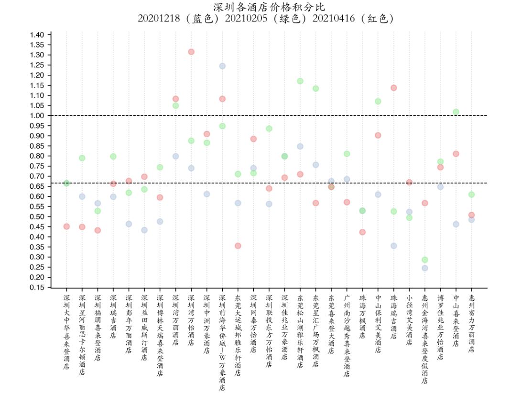
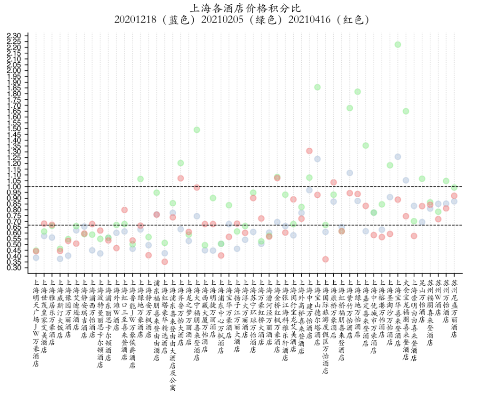
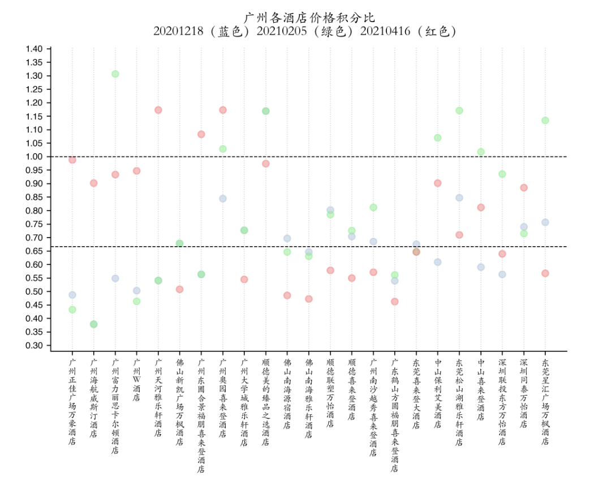

# 万豪酒店房晚价格积分比

- https://github.com/gop167/Marriot-hotel-bussiness.git


## 缘由

- 万豪酒店体系既可以支付房间费用也可以用积分兑换房晚
- 积分价格按照 Cat 区别等级，直接房价虽考虑到这些因素，却不一定与积分等值
- 万豪的积分可以用美元购买，价格是 1000 积分 12.5 美元（来源:https://storefront.points.com/marriott）常年稳定。中国市场的场外价格1000积分 50 元（来源：咸鱼）
- 时常有积分活动参加，例如额外送 60% 或者 50% 积分等
- 积分房有住 5 付 4 的福利，但积分也面临着贬值的风险，另外有些升级计算不算积分房

## 目标

- 得到深圳、上海、广州城市的酒店价格（积分价格和直接预定价格）

- 计算同一房晚的价格积分比（price point ratio, ppr）

  - 为了计算和可视化方便，将 1000 积分 对应 12.5 美元时的 ppr 作为 0

  - 美元兑人民币汇率取 6.47

  - 
    $$
    standard\ ppr =\dfrac {price/point} {12.5 \times 6.47/1000}
    $$

  - 

  - ppr = 1 意味着和原价购买的积分等值；ppr > 1 代表积分的价值比原价更高，使用积分更划算；ppr < 1 代表积分的价值比原价更低，直接购买更划算
  - 可视化 1
    - 所有城市的 ppr，应该有 4 张图，每张图酒店（x 轴）ppr（y 轴）
    - 指出 benchmark，即直接购买积分的 ppr 和参与活动的 ppr

  - 可视化 2
    -  对比所有城市在这些日期的酒店平均 ppr
    -  图中也可以指出每个城市的平均 ppr

## 房晚数据源说明

- 来自[万豪中国官网 - https://www.marriott.com.cn](https://www.marriott.com.cn)
- 数据提取日期：20201213（价格可能会当日浮动）
- 提取方式，手动复制网站数据，命名为 City-YYYYMMDD.txt
- 三组日期数据，每个日期三个城市，共 9 个 txt 文件
- 以白金会员身份登陆查询，显示含税及所有费用的房价，对一家酒店，选择是是起步价（可能是大床或者双床房）
- 城市可能包含周边城市的其他距离较近的酒店（例如深圳广州包含了部分东莞的酒店）

## 房晚数据清洗

- 主要难点是如何从 txt 中提取信息
  - 最初试图采用 re 模块，先提取 segment，再在每个 segment 中提取 hotel_name, price_in_cny, points，但是 re 过于复杂了
  - 后面采用 readlines 得到解决
  - 由于网站上得到的可能有不同的结构，所以在 try 结构中用了 3 层，尝试 3 种可能的情况（后两者分别 offset）
- 生成 9 个 csv 文件保存在 CSVResult 文件夹中，命名方式和 txt 相同
- 补充清洗过程，将同一个城市不同 date 的数据合并，删除没有数据的酒店，最终的结果是 3 个 City.csv

```python
import os
import glob
import pandas as pd


cities = ['Shenzhen', 'Shanghai', 'Guangzhou']
dates = ['20201218', '20210205', '20210416']

t = tuple((c, p) for c in cities for p in dates)
for city, date in t[:]:
    src = city + '-' + date + '.txt'

    with open('PriceData/' + src) as f:
        lines = f.readlines()
    
    data = []  # list of [hotel_name, price_in_cny, points]
    lines = [line for line in lines if line.strip(' ') != '\n']  # 移除所有空行
    for i, line in enumerate(lines):
        if '距目的地' in line:  # 令人意外地，“距目的地”才是要找的锚点
            temp = []
            hotel_name = lines[i-4].strip()
            temp.append(hotel_name)
            try:
                price_in_cny = int(lines[i+3].replace(' CNY /每晚 起\n', '').replace(',', ''))  # 排除了其他货币
                temp.append(price_in_cny)
                points = int(lines[i+2].replace(' 积分／住宿\n', '').replace(',', ''))
                temp.append(points)
            except Exception:
                try:  # 如果没找到，尝试 offset
                    price_in_cny = int(lines[i+2].replace(' CNY /每晚 起\n', '').replace(',', ''))
                    temp.append(price_in_cny)
                    points = int(lines[i+1].replace(' 积分／住宿\n', '').replace(',', ''))
                    temp.append(points)
                except Exception:
                    try:  # 如果没找到，尝试 offset
                        price_in_cny = int(lines[i+4].replace(' CNY /每晚 起\n', '').replace(',', ''))
                        temp.append(price_in_cny)
                        points = int(lines[i+3].replace(' 积分／住宿\n', '').replace(',', ''))
                        temp.append(points)
                    except Exception as err:
#                         print(name, err)
                        continue
            data.append(temp)
    
    frame = pd.DataFrame(data, columns=('hotel_name', 'price_in_cny', 'points'))
    frame['ppr'] = frame['price_in_cny'] / frame['points'] * 12.220643722
    os.makedirs('CSVResult', exist_ok=True)
    frame.to_csv('CSVResult/' + src.replace('txt', 'csv'))
    
# 补充清洗过程，将同一个城市不同 date 的数据合并，连接方式为 inner
for city in cities[:]:
    # 设置初始 frame
    frame = pd.read_csv('CSVResult/' + city + '-' + dates[0] + '.csv', usecols=['hotel_name', 'ppr'])
    
    frame = frame.merge(
        pd.read_csv('CSVResult/' + city + '-' + dates[1] + '.csv', 
        usecols=['hotel_name', 'ppr']),
        on='hotel_name',
        suffixes=['_' + dates[0], ''],
        how='outer'
    )
    frame = frame.merge(
        pd.read_csv('CSVResult/' + city + '-' + dates[2] + '.csv', 
        usecols=['hotel_name', 'ppr']),
        on='hotel_name',
        suffixes=['_' + dates[1], '_' + dates[2]]
    )
    frame.to_csv('CSVResult/{}.csv'.format(city))
```


## 积分价格说明和 promotion

- 数据查询日期：20201213
- 非活动价格：1000 积分 12.5 美元
- 活动价格：送 50%，等于 66 折
- [万豪积分活动 - https://storefront.points.com](https://storefront.points.com/marriott/zh-CN/buy?irgwc=1&backupAssets)
- 在这样的情况下有 ppr_promotion = 1 / (1+0.5) = 0.666...


## 数据可视化

- 对于同一城市，不同散点颜色代表不同的淡旺季
- 两根与 x 轴平行的辅助线代表了不同积分活动下的 benchmark 移动（y = 1 表示无活动）
- benchmark 横线代表该积分活动的 ppr 基准，在 benchmark 以上的散点说明积分的价值高于 benchmark，用积分划算


```python
import os
import numpy as np
import matplotlib as mpl
import matplotlib.pyplot as plt
import pandas as pd
from matplotlib.font_manager import FontProperties

# 自定义字体（楷体-简）
kai = FontProperties(fname=os.getenv('HOME') + '/Library/Mobile Documents/com~apple~CloudDocs/Syncing/KaitiSC-Regular.ttf')

# 使用自定义模板
mpl.style.use('~/Library/Mobile Documents/com~apple~CloudDocs/Syncing/kvt-academic.mplstyle')
mpl.rcParams['font.size'] = 8

cities = ['Shenzhen', 'Shanghai', 'Guangzhou']
cities_chs = ['深圳', '上海', '广州']
dates = ['20201218', '20210205', '20210416']
colors = ['lightsteelblue', 'lightgreen', 'lightcoral']

# promotions = [0]
promotions = [0, 0.5]  # 买 1 加送 promotion


for city in cities[:]:
    frame = pd.read_csv('CSVResult/' + city + '.csv', index_col=0)

    ax = plt.gca()
    title = '{}各酒店价格积分比\n{}（蓝色）{}（绿色）{}（红色）'.format(cities_chs[cities.index(city)], *dates)
    kai.set_size(12)
    ax.set_title(title, fontproperties=kai)
#     ax.set_ylabel('ppr')

    for date in dates[:]:
        ax.scatter(*zip(*enumerate(frame['ppr_' + date])), label=date, color=colors[dates.index(date)], alpha=0.5)
    ax.set_xticks(range(len(frame)))
    
    # 竖着展示酒店名称
    def vertical_label(string):
        return '\n'.join(s for s in list(string) if s != ' ')
    kai.set_size(8)
    ax.set_xticklabels(frame['hotel_name'].map(vertical_label), fontproperties=kai)
    
    # 沿着每个坐标 tick 位置添加辅助竖线方便定位
    ax.vlines(range(len(frame)), 0, 5, color='lightgrey', linestyles='dotted')
    
    # 在 y = 1 / (1+promotion) 处添加横向定位
    ax.set_xlim(-1, len(frame))
    ax.hlines([1 / (1+p) for p in promotions], -1, len(frame), color='k', linestyles='dashed')
    
    # 对 y 轴进一步优化
    ax.set_yticks(np.arange(0, 5, 0.05))
    ymin = frame.iloc[:, 1:].values.min()
    ymax = frame.iloc[:, 1:].values.max()
    ax.set_ylim(ymin-0.1, ymax+0.1)

    # 保存并展示
    plt.savefig(city)
    plt.show()
```







## （待开发内容）

- 现在是三个日期数据，可以添加多个日期
- 和美元的实时汇率挂钩
- 场外积分价格还未做一份